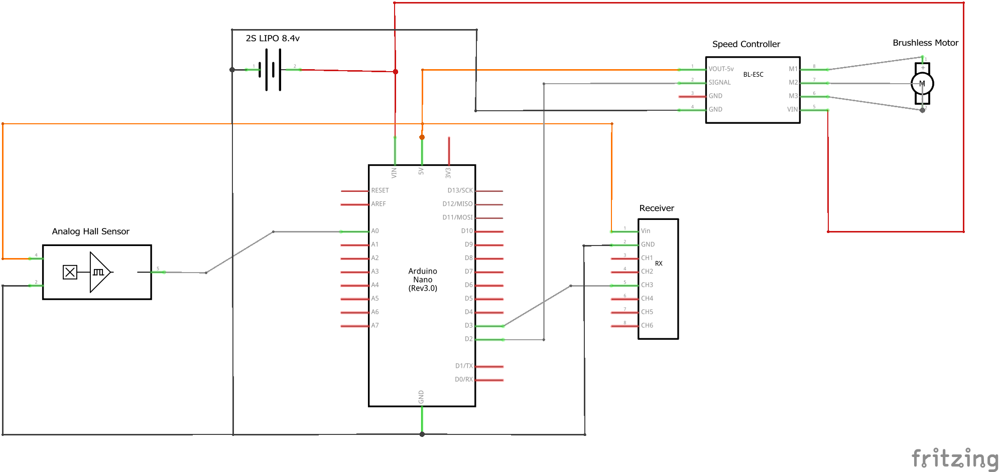

# GlideLock
This is a sketch for the [glide lock](http://ovirc.free.fr/GLDAB_English.php) of a crank-driven ornithopter. 
The glide lock works by iddling the motor below a certain throttle until the crankshaft reaches a known position.
Doing so allows to wings to stop a dihedral angle that allows for efficient gliding flight.
To accomplish this the code uses a hall sensor that looks for a magnet attached to the crank. 
Once the magnet is infront of the sensor the motor turns off.

Unfortunately some ESC's respond with a delay to throttle commands.
This means that the motor will continue to spin even after the throttle is set to zero. 
In practice this means the crank will stop at the wrong position.
To work around this one can run the motor for a short time interval after the magnet passes the sensor.
If this delay is tuned correctly the crank will stop in the desired position.

There are two versions of the sketch: one that's intended for an analog hall sensor and uses polling, 
and one that's intended for a digital hall sensor and uses an external interrupt. 
Both work well although the interrupt version can recognize the magnet at higher RPM's.

This code was made to work for the following circuit:  
</img>

See this video to see the glide lock working:  

